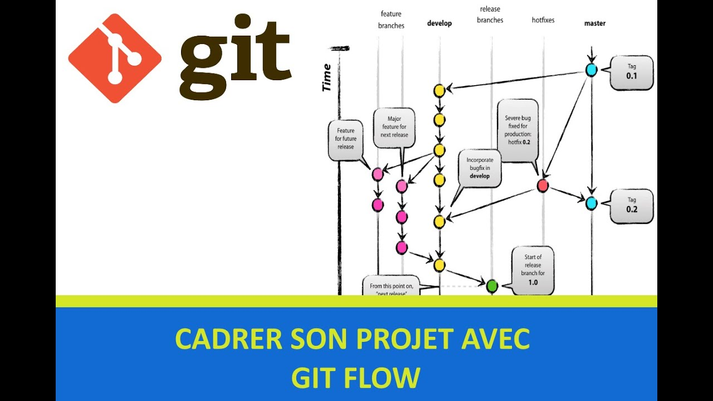

# Essentiel De Git Flow

git-flow est un modèle de branche, qui est fourni avec de la documentation, et un plugin git pour ajouter des commandes qui facilitent le travail.

## Pour Initialiser Son Projet A Git Flow

<pre>
<code>
	git flow init
</code>
</pre>

## Pour Demarrer Une Nouvelle Fonctionnalité

<pre>
<code>
	git flow feature start nomBranch
</code>
</pre>

## Pour Vérifier Quelle Branch On est Actuellement

<pre>
<code>
	git branch
</code>
</pre>

## Pour Pousher(Envoyer à distance) Une Modification

<pre>
<code>
	git flow feature publish nomBranch
</code>
</pre>

## Pour Récuperer Une Modification A distance

<pre>
<code>
	git flow feature pull origin nomBranch
</code>
</pre>

## Quand On finit Une Fonctionnalité

<pre>
<code>
	git flow feature finish nomBranch
</code>
</pre>

## Quand On Veut Créer Un Release

<pre>
<code>
	git flow release start version
</code>
</pre>

## Quand On Veut Deployer Notre Release 

<pre>
<code>
	git flow release finish version
</code>
</pre>

## Quand On Veut Publier Notre Release 

<pre>
<code>
	git push --tag
	git push origin main
	git push origin develop
</code>
</pre>

## Quand On Veut Faire Un fix

<pre>
<code>
	git flow hotfix start nomHotFix
</code>
</pre>

## Pour Afficher Les Historiques

<pre>
<code>
	git log --graph --oneline --first-parent nomDeLaBranch
</code>
</pre>

## Liens Utils

* [https://mindsers.blog/fr/post/gitflow-la-methodologie-et-la-pratique/](https://mindsers.blog/fr/post/gitflow-la-methodologie-et-la-pratique/)
* [https://grafikart.fr/tutoriels/git-flow-742](https://grafikart.fr/tutoriels/git-flow-742)